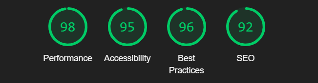
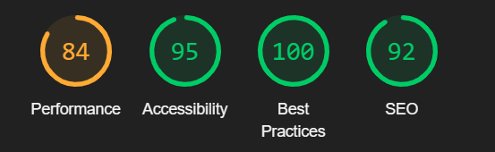

# Taste & Toast

Welcome to Taste & Toast, a modern restaurant that combines culinary excellence with convenience. Our website serves as your gateway to our delightful dining experience, offering a comprehensive look at our restaurant, easy reservation options, and the ability to order our delicious meals online.

## Table of Contents

- [Features](#features)
- [Tech Stack](#tech-stack)
- [Installation](#installation)
- [Environment Variables](#environment-variables)
- [API Reference](#api-reference)
- [Screenshots](#screenshots)
- [Feedback](#feedback)

## Features

- Explore our story, meet our team, make reservations, explore menu and signature dishes
- Order food online
- Virtual tour of our restaurant space
- Read customer reviews and testimonials
- Mobile-responsive design for seamless browsing on all devices
- Multi-language support to cater to a diverse clientele
- Highly accessible interface, ensuring a great experience for all users
- Optimized for high performance and fast loading times
- SEO-friendly structure to improve visibility in search results

## Tech Stack

Our website is built using the following technologies:

- Frontend: React.js with Vite as the build tool
- Backend: Node.js with Express.js
- Payment Processing: Stripe
- Styling: CSS with Tailwind CSS and shadcn/ui component library

## Installation

To set up the Taste & Toast website locally, follow these steps:

1. Clone the repository:

   ```bash
   git clone https://github.com/tarek-gritli/taste-and-toast.git
   ```

2. Navigate to the frontend directory and install dependencies:

   ```bash
   cd frontend
   npm install
   ```

3. Start the frontend development server:

   ```bash
   npm run dev
   ```

4. Navigate to the backend directory, and install dependencies:

   ```bash
   cd backend
   npm install
   ```

5. Start the backend server:

   ```bash
   npm run dev
   ```

6. Open your browser and visit `http://localhost:5173` to view the website.

Note: Ensure that both the frontend and backend servers are running simultaneously for full functionality.

## Environment Variables

To run this project, you will need to add the following environment variables:

### Backend (.env file)

`PORT`

`FRONTEND_URL`

`STRIPE_SECRET_KEY`

### Frontend (.env file)

`VITE_API_URL`

## API Reference

Our backend API provides the following endpoint:

- `POST /api/create-checkout-session`: Create a checkout session for the order

## Screenshots

### Desktop Performance



### Mobile Performance



### Quick Tour

For a quick tour of the application's features, check out the [video](./screenshots/quick-tour.mp4).

## Feedback

If you have any feedback, please reach out to me at gritli.tarek66@gmail.com
